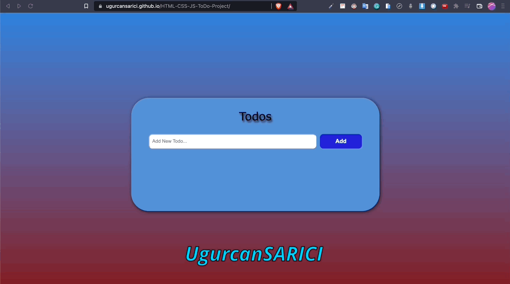

# JavaScript_Todo_list
Todo List

## Description
Project aims to create Todo_list within html, css and js.

  Project Name       |Libraries and Technologies I use     |How does my project look   
:-------------------------|-------------------------|-------------------------
[Todo_list](https://ugurcansarici.github.io/HTML-CSS-JS-ToDo-Project/)| Html Css Js |

## Problem Statement
- My project to improve html,css and js tutorials

## Project Design

- Figma 

## Project Skeleton 

Todo_list (folder)
|----images
|----readme.md                 
|----index.html  
|----style.css  
|----app.js
       
       

## Expected Outcome

## Objective

Functionally create a Todo_list as in the image above

### At the end of the project, following topics are to be covered;

- HTML List

- HTML İnput

- CSS Colors-Border Properties

- CSS Margins-Padding

- CSS Properties for Texts-Font Families-Links

- Js GetElementById, QuerySelector(),  Dom , global storage , local storage ...

## Steps to Solution
  
- Step 1: Download or clone project repo on Github 

- Step 2: Create project folder for local public repo on your pc

- Step 3: Create Todo_list

>>Part-1 HTML Structure

	- Creat structure of the HTML5
	- Give name of your project (title)
	- Create the main structure of the container (div id="container")
	- Create Main Topic of the project (id="title")
	- Create a description of your project (id="description")
	- Create a form (id="Todo_list")
	

>>Part-2 CSS Structure
	- Set a background and define font-color="white"
	- Set container background color and margin
	- Define "title" and "description" color-size-padding etc...
	- Define "Todo_list" color-size-padding etc..
	- Define labels color-size-padding etc... 
	- Set class color-size-padding-margin etc...
	- Define id="submit" color-size-padding etc...
	
- Step 4: Push your application into your own public repo on Github

- Step 5: Deploy your application on Github template to showcase your app within your team.

## Notes

- You can use HTML,and CSS to complete this project.

